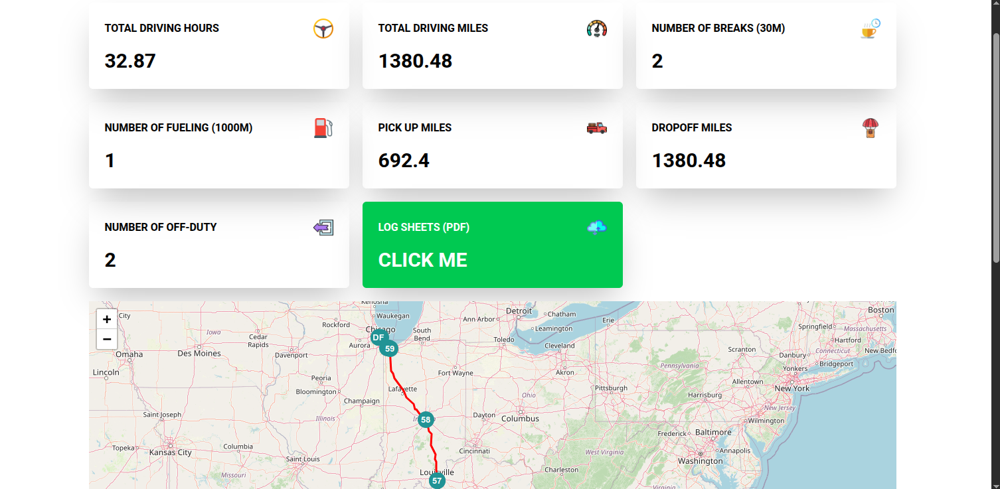

### **🚛 Smart Truck Planner – Optimize Your Routes, Drive Smarter!**



 

#### **Overview**

Smart Truck Planner is a powerful route planning tool designed specifically for **US truck drivers**. It helps drivers **optimize fuel stops, manage rest breaks, and comply with DOT regulations** effortlessly. With a user-friendly interface and smart algorithms, this planner ensures **better efficiency, lower costs, and stress-free journeys**.

#### **Features**

✅ **Smart Route Optimization** – Plan the best routes with optimal fuel and rest stops.  
✅ **DOT Compliance** – Stay within legal driving limits effortlessly.  
✅ **Live Traffic & Weather Updates** _(Planned feature)_  
✅ **Custom Break & Stop Tracking** – Automated break reminders to maximize efficiency.  
✅ **User-Friendly Dashboard** – A simple interface to plan your trips with ease.

#### **How It Works**

1. **Enter Your Route** – Input your starting point and destination.
2. **Optimize Your Journey** – The planner suggests ideal stops based on your truck’s needs.
3. **Drive & Stay Compliant** – Get notified about mandatory rest breaks and fueling stops.

#### **Installation & Setup**

```bash
git clone https://github.com/ayoub-drf/truck-route-planner.git
cd truck-route-planner
cd src/frontend/ && npm install   # For frontend dependencies
pip install -r src/backend/requirements.txt  # For backend (Django) dependencies
```

#### **Run the Project**

```bash
# Start Backend (Django)
python manage.py src/backend/runserver

# Start Frontend (React or Vite)
cd src/frontend/ && npm run dev

# or 
docker-compose up
``` 

#### **Contributing**

We welcome contributions! Feel free to submit a PR or open an issue.

#### **License**

📜 **MIT License** – Use, modify, and distribute freely.

--
